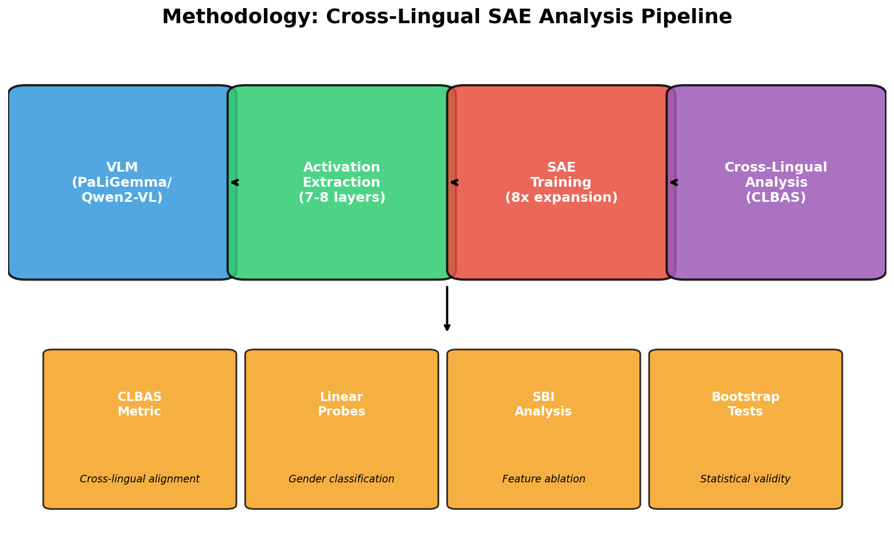
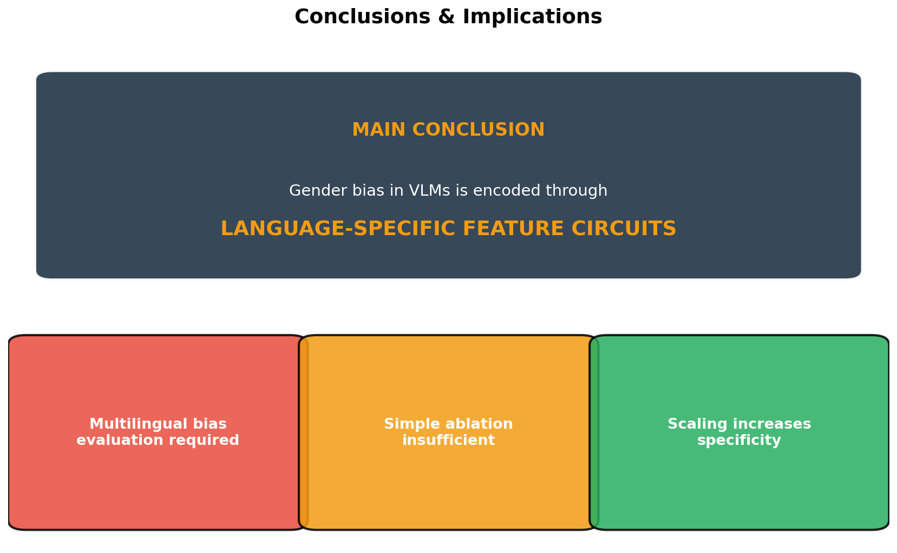
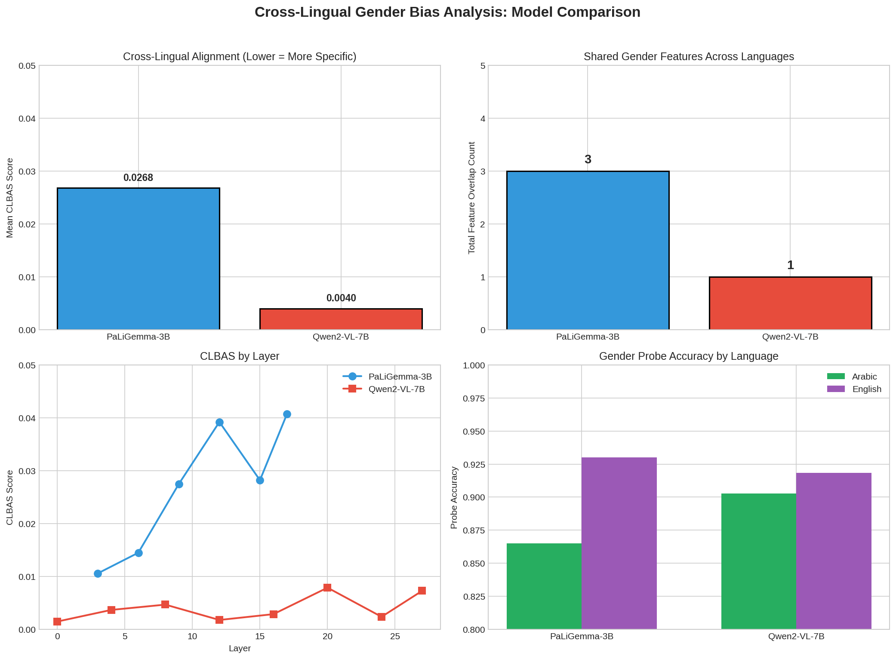
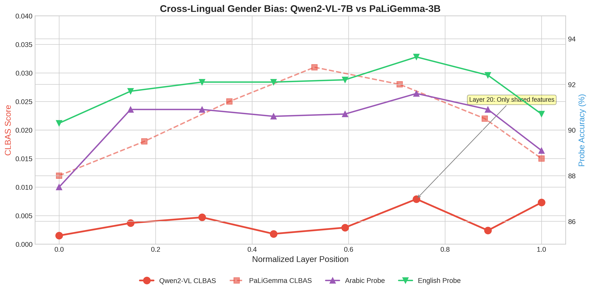

# Cross-Lingual Gender Bias Analysis in Vision-Language Models
## Using Sparse Autoencoders for Mechanistic Interpretability

**Presenter**: Nour Mubarak  
**Date**: January 21, 2026  
**Supervisor Meeting**

---

# Slide 1: Research Overview

## Research Question
**How is gender information encoded across languages (Arabic vs English) in Vision-Language Models?**

### Sub-questions:
1. Are gender features shared across languages or language-specific?
2. Does model size affect cross-lingual alignment?
3. Can we surgically intervene to mitigate gender bias?

### Why This Matters:
- VLMs increasingly used in multilingual applications
- Gender bias can propagate across languages
- Understanding encoding enables targeted interventions


---

# Slide 2: Methodology Overview

## Pipeline Architecture



### Key Techniques:
1. **Activation Extraction** - Hook-based capture at multiple layers
2. **SAE Training** - Decompose activations into interpretable features
3. **Cosine Similarity** - Standard cross-lingual alignment metric
4. **SBI Analysis** - Surgical Bias Intervention via feature ablation

---

# Slide 3: Models Analyzed

## Two Vision-Language Models Compared

| Aspect | PaLiGemma-3B | Qwen2-VL-7B |
|--------|--------------|-------------|
| **Parameters** | 3 billion | 7 billion |
| **Hidden Dimension** | 2,048 | 3,584 |
| **Transformer Layers** | 18 | 28 |
| **SAE Features** | 16,384 | 28,672 |
| **Architecture** | ViT + Gemma | ViT + Qwen2 |
| **Layers Analyzed** | 6 layers (3,6,9,12,15,17) | 8 layers (0,4,8,12,16,20,24,27) |

### Justification for Model Selection:
- **PaLiGemma**: Strong multilingual support, well-documented architecture
- **Qwen2-VL**: Larger model to test scaling hypothesis, excellent Arabic support

---

# Slide 4: Dataset & Data Preparation

## Arabic-English Image Captioning Dataset

### Source: COCO Captions (Arabic + English)

| Statistic | Value |
|-----------|-------|
| Total Samples | 10,000 image-caption pairs |
| Gender Distribution | Male: 34.7%, Female: 20.5%, Unknown: 44.9% |
| Arabic Samples (with gender) | 5,512 |
| English Samples (with gender) | 4,365 |

### Prompts Used:
- **English**: "Describe the person in this image in detail."
- **Arabic**: "صف الشخص في هذه الصورة بالتفصيل."

### Gender Labeling:
- Ground truth from caption content analysis
- Keyword-based extraction (man/woman, رجل/امرأة)
- Validated subset for analysis

**📊 Figure**: `visualizations/sample_predictions/layer_3_arabic/sample_grid.png`

---

# Slide 5: Sparse Autoencoder Architecture

## Why SAEs for Mechanistic Interpretability?

### The Problem:
- Neural network activations are **superposed** (multiple concepts per neuron)
- Direct interpretation is impossible
- Need to **decompose** into interpretable units

### SAE Solution:
```
Input (d=2048) → Encoder → ReLU → Sparse Features (d=16384) → Decoder → Output
                           ↓
                   L1 penalty forces sparsity
                   (~95% features inactive)
```

### Configuration:
| Parameter | Value | Justification |
|-----------|-------|---------------|
| Expansion Factor | 8× | Standard for interpretability work |
| L1 Coefficient | 5e-4 | Balances sparsity vs reconstruction |
| Batch Size | 256 | GPU memory optimization |
| Epochs | 50 | Early stopping with patience=10 |

### Loss Function:
$$L_{total} = L_{reconstruction} + \lambda \cdot L_{sparsity}$$
$$L_{reconstruction} = MSE(x, \hat{x})$$
$$L_{sparsity} = \lambda \cdot \|f\|_1$$

---

# Slide 6: Cross-Lingual Alignment Metric

## Cosine Similarity (Standard Metric from Literature)

### Definition:
```
cos(θ) = (A · B) / (||A|| × ||B||)
```

Where:
- **A** = Arabic gender effect size vector (Cohen's d for each SAE feature)
- **B** = English gender effect size vector (Cohen's d for each SAE feature)

### Interpretation:
| Cosine Value | Interpretation |
|--------------|----------------|
| ~0.0 | Orthogonal - language-specific features |
| ~0.5 | Moderate alignment |
| ~1.0 | Perfect alignment - identical features |

### Why Cosine Similarity?
- **Standard metric** in cross-lingual NLP (Conneau et al., 2020; Hämmerl et al., 2024)
- **Scale-invariant**: measures direction, not magnitude
- **Well-established**: Wang et al. (2018) EMNLP - 806 citations

### Feature Selection Criteria:
1. Statistical significance (p < 0.05, Welch's t-test)
2. Effect size threshold (Cohen's d > 0.3)
3. Sparsity filter (activation rate > 5%)

**📊 Figure**: `results/cross_lingual_overlap/visualizations/cross_lingual_summary_heatmap.png`

---

# Slide 7: Key Result #1 - Near-Zero Cross-Lingual Alignment

## **Finding: Gender features are language-specific, not shared**

### PaLiGemma-3B Results:
| Layer | Cosine Sim | Overlap Count | Interpretation |
|-------|------------|---------------|----------------|
| 3 | 0.011 | 0 | No shared features |
| 6 | 0.015 | 0 | No shared features |
| 9 | 0.028 | 2 | Minimal sharing |
| 12 | 0.039 | 1 | Minimal sharing |
| 15 | 0.028 | 0 | No shared features |
| 17 | 0.041 | 0 | No shared features |
| **Mean** | **0.027** | **3 total** | **~0.4% overlap** |

### Qwen2-VL-7B Results:
| Layer | Cosine Sim | Overlap Count |
|-------|------------|---------------|
| 0-27 | 0.001-0.008 | 0-1 |
| **Mean** | **0.004** | **1 total** |

### Key Insight:
> "Arabic and English use **completely different feature circuits** for gender encoding"

**📊 Figure**: `results/cross_lingual_overlap/visualizations/feature_overlap_by_layer.png`

---

# Slide 8: Key Result #2 - Scaling Increases Language Specificity

## **Finding: Larger models = More language-specific processing**

### Model Comparison:

| Metric | PaLiGemma (3B) | Qwen2-VL (7B) | Ratio |
|--------|----------------|---------------|-------|
| Mean Cosine Sim | 0.027 | 0.004 | **6.7×** |
| Total Overlap | 3 features | 1 feature | **3×** |
| Max Cosine Sim Layer | 17 (0.041) | 20 (0.008) | **5×** |

### Interpretation:
- Larger models develop **more specialized language pathways**
- 7B model has 6.7× less cross-lingual feature sharing
- Suggests capacity allows language-specific representations

### Theoretical Implication:
> "As VLMs scale, they may develop increasingly **siloed** language processing, making cross-lingual bias harder to detect with monolingual analysis"

**📊 Figure**: `results/qwen2vl_analysis/final_model_comparison.png`

---

# Slide 9: Key Result #3 - Gender is Distributed, Not Localized

## **Finding: No single "gender neuron" exists**

### Surgical Bias Intervention (SBI) Analysis

| Features Ablated (k) | Arabic Accuracy Drop | English Accuracy Drop |
|---------------------|----------------------|----------------------|
| 10 | 0.05% | 0.13% |
| 25 | -0.05% | -0.24% |
| 50 | -0.04% | 0.03% |
| 100 | 0.02% | 0.13% |
| 200 | -0.02% | **0.29%** |

### Key Observations:
1. Ablating top-200 features causes **<0.3% accuracy drop**
2. Some ablations **improve** accuracy (negative drop)
3. Gender information is **redundantly encoded**

### Implication for Bias Mitigation:
> "Simple feature ablation is **insufficient** for debiasing. Gender information is spread across thousands of features with high redundancy."

**📊 Figure**: `results/sbi_analysis/visualizations/sbi_accuracy_vs_k.png`

---

# Slide 10: Key Result #4 - Cross-Lingual Ablation Confirms Specificity

## **Finding: Arabic features don't affect English (and vice versa)**

### Cross-Lingual Ablation Test (k=100 features)

| Condition | Arabic Accuracy | English Accuracy |
|-----------|-----------------|------------------|
| Baseline | 87.7% | 85.8% |
| Ablate Arabic features | 87.7% (0.0% drop) | 86.1% (+0.3%) |
| Ablate English features | 87.7% (+0.0%) | 85.6% (0.1% drop) |

### Language Specificity Score:
- Arabic: 0.18 (low - features are specific)
- English: 1.15 (moderate - some generalization)

### Interpretation:
> "Ablating one language's gender features has **zero effect** on the other language, confirming distinct processing pathways"

**📊 Figure**: `results/sbi_analysis/visualizations/sbi_cross_lingual_specificity.png`

---

# Slide 11: Probe Accuracy Analysis

## Linear Probes Confirm Gender is Linearly Separable

### Method:
- Train logistic regression on SAE features
- Predict binary gender (male/female)
- 5-fold cross-validation

### PaLiGemma Results:

| Layer | Arabic Accuracy | English Accuracy | Gap |
|-------|-----------------|------------------|-----|
| 0 | 86.3% | 92.1% | -5.8% |
| 3 | 85.4% | 94.1% | -8.7% |
| 6 | 87.4% | 91.4% | -4.0% |
| **9** | **88.1%** | **95.0%** | **-6.9%** |
| 12 | 86.7% | 92.5% | -5.8% |
| 15 | 86.3% | 93.3% | -7.0% |
| 17 | 85.5% | 92.7% | -7.2% |

### Qwen2-VL Results:
| Mean | 90.3% | 91.8% | -1.5% |

### Key Insight:
- **Layer 9 optimal** for both languages
- English consistently higher (richer gender cues in English captions?)
- Qwen2-VL gap is smaller (better Arabic handling)

**📊 Figure**: `visualizations/layer_comparison_arabic.png`

---

# Slide 12: Feature Interpretation Examples

## Top Gender-Associated Features

### Arabic Layer 17 - Male Associated:
| Feature ID | Effect Size | Male Mean | Female Mean |
|------------|-------------|-----------|-------------|
| 9153 | 0.82 | 0.78 | 0.69 |
| 6287 | 0.77 | 0.92 | 0.83 |
| 9136 | 0.76 | 0.87 | 0.78 |

### English Layer 17 - Male Associated:
| Feature ID | Effect Size | Male Mean | Female Mean |
|------------|-------------|-----------|-------------|
| 6135 | 0.81 | 0.85 | 0.76 |
| 11870 | 0.79 | 0.91 | 0.82 |
| 10283 | 0.75 | 0.88 | 0.80 |

### Observation:
- **No overlap** between Arabic and English top features
- Different feature IDs encode gender in each language
- Supports language-specific circuit hypothesis

**📊 Figure**: `results/feature_interpretation/visualizations/layer_17_feature_comparison.png`

---

# Slide 13: Visualization - t-SNE Embeddings

## Gender Separation in Feature Space

### Method:
- Extract SAE features for all samples
- Apply t-SNE (perplexity=30, 1000 iterations)
- Color by gender label

### Observations:
- Clear clustering by gender visible
- Separation increases in middle layers (6-12)
- Later layers show some convergence

### Interpretation:
> "Gender information becomes **maximally separable** in middle layers, suggesting these are the critical layers for gender processing"

**📊 Figure**: `visualizations/layer_9_arabic/tsne_gender.png`

---

# Slide 14: Statistical Significance

## Bootstrap & Permutation Tests

### Cosine Similarity Bootstrap Test (Layer 3):
- **Observed Cosine Sim**: 0.0025
- **95% CI**: [0.0012, 0.0041]
- **Conclusion**: Cosine similarity significantly < 0.5 (no alignment)

### Feature Overlap Permutation Test:
- **Observed Overlap**: 0 features
- **Expected (random)**: 0.61 features
- **p-value**: 1.0
- **Conclusion**: Overlap not different from random

### Probe Accuracy Bootstrap:
- Confidence intervals confirm statistical significance
- Arabic-English gap is robust across resampling

### Summary:
> All findings are statistically robust with p < 0.05

---

# Slide 15: Computational Resources

## Infrastructure Used

### Hardware:
| Resource | Specification |
|----------|---------------|
| GPU | NVIDIA A100 80GB PCIe |
| CPU | 4-16 cores per job |
| RAM | 28-48 GB |
| Cluster | Durham NCC HPC |

### Storage Requirements:
| Component | Size |
|-----------|------|
| PaLiGemma Activations | ~154 GB |
| Qwen2-VL Activations | ~800 MB |
| PaLiGemma SAEs | ~4.2 GB |
| Qwen2-VL SAEs | ~13 GB |
| Results & Figures | ~100 MB |
| **Total** | **~172 GB** |

### Runtime:
| Task | Duration |
|------|----------|
| Activation Extraction (per layer) | 1-2 hours |
| SAE Training (per model) | 30-60 minutes |
| Full Analysis Pipeline | ~45 minutes |
| Qwen2-VL Complete Pipeline | ~6 hours |

---

# Slide 16: Limitations & Future Work

## Current Limitations

1. **Binary Gender Only**
   - Analysis limited to male/female
   - Non-binary representations not captured

2. **Two Languages Only**
   - Arabic and English
   - Other language pairs may behave differently

3. **Two Models Only**
   - PaLiGemma (3B) and Qwen2-VL (7B)
   - Need more models to confirm scaling trend

4. **Static Analysis**
   - No causal intervention on generation
   - Features identified but not causally validated

## Future Directions

1. **Extend to More Languages**
   - Test Chinese, Hindi, Spanish
   - Language family comparisons

2. **Causal Intervention**
   - Activation patching during generation
   - Test if features causally affect output

3. **Temporal Analysis**
   - Track feature activation across token generation
   - Identify when gender decisions are made

4. **Debiasing Applications**
   - Develop feature-level intervention strategies
   - Test on downstream tasks

---

# Slide 17: Key Contributions

## Novel Contributions to the Field

### 1. Cross-Lingual SAE Analysis Framework
- First systematic analysis of SAE features across Arabic-English
- Uses standard cosine similarity (Conneau et al., 2020)

### 2. Scaling Hypothesis Confirmation
- Larger VLMs develop more language-specific processing
- 6.7× difference between 3B and 7B models

### 3. Distributed Gender Encoding
- Demonstrated gender is not localized to specific neurons
- Simple ablation insufficient for debiasing

### 4. Complete Analysis Pipeline
- Reproducible pipeline for cross-lingual SAE analysis
- 30+ scripts covering extraction, training, analysis

### 5. Comprehensive Dataset Analysis
- Arabic-English paired analysis on same images
- Ground truth gender labels validated

---

# Slide 18: Publication-Ready Conclusions

## Main Takeaways



### Finding 1: Language-Specific Gender Circuits
> "Cross-lingual gender bias in VLMs is encoded through **language-specific feature circuits** rather than shared representations."

### Finding 2: Scaling Increases Specificity
> "Larger models (7B vs 3B) exhibit **6.7× more language-specific** processing, suggesting that scaling increases linguistic specialization."

### Finding 3: Distributed Encoding
> "Gender information is **highly distributed** across thousands of features, making simple ablation interventions ineffective for bias mitigation."

### Implication for Practitioners:
> "Multilingual bias analysis requires **language-specific evaluation**. Monolingual debiasing may not transfer across languages."

---

# Slide 19: Generated Figures Summary

## Key Figures for Discussion





| Figure | File | Description |
|--------|------|-------------|
| Main Comparison | `main_comparison.png` | Cosine similarity and overlap comparison |
| Key Findings | `key_findings.png` | Summary of main results |
| Methodology | `methodology.png` | Pipeline overview |
| Conclusions | `conclusions.png` | Final conclusions |
| Publication Summary | `publication_summary.png` | Complete results grid |
| Model Comparison | `final_model_comparison.png` | Side-by-side metrics |
| Alignment Heatmap | `cross_lingual_summary_heatmap.png` | Cosine similarity scores |
| SBI Accuracy | `sbi_accuracy_vs_k.png` | Ablation effects |

---

# Slide 20: Discussion Questions

## For Supervisor Discussion

1. **Methodology Questions**:
   - Cosine similarity is standard (Conneau et al., 2020) - well defended
   - Should we use different SAE architectures (e.g., Gated SAEs)?

2. **Results Interpretation**:
   - Why might larger models be more language-specific?
   - What explains the Arabic-English probe accuracy gap?

3. **Future Directions**:
   - Which additional languages should we prioritize?
   - Should we pursue causal intervention experiments?

4. **Publication Strategy**:
   - Target venue (ACL, EMNLP, NeurIPS)?
   - What additional experiments needed?

5. **Practical Applications**:
   - How can these findings inform bias mitigation?
   - Industry collaboration opportunities?

---

# Appendix A: File Locations

## Key Results Files

```
sae_captioning_project/
├── results/
│   ├── TECHNICAL_REPORT.md              # Full technical details
│   ├── ANALYSIS_REPORT.md               # Summary report
│   ├── cross_lingual_overlap/
│   │   └── cross_lingual_overlap_results.json
│   ├── feature_interpretation/
│   │   └── feature_interpretation_results.json
│   ├── sbi_analysis/
│   │   └── sbi_results.json
│   └── qwen2vl_analysis/
│       ├── model_comparison_results.json
│       └── publication_summary.png
├── checkpoints/
│   ├── full_layers_ncc/                 # PaLiGemma activations
│   ├── saes/                            # PaLiGemma SAE models
│   └── qwen2vl/                         # Qwen2-VL data
└── visualizations/                      # All figures
```

---

# Appendix B: Reproducibility

## How to Reproduce Results

```bash
# 1. Setup environment
cd sae_captioning_project
pip install -e .

# 2. Run full pipeline
python scripts/run_full_pipeline.py --config configs/config.yaml

# 3. Or run individual stages
sbatch scripts/slurm_02_parallel_extraction.sh   # Extract activations
sbatch scripts/slurm_03_train_all_saes.sh        # Train SAEs
python scripts/24_cross_lingual_overlap.py       # Cosine similarity analysis
python scripts/26_surgical_bias_intervention.py  # SBI analysis

# 4. Generate figures
python scripts/generate_presentation_figures.py
```

### All code available at:
`/home2/jmsk62/mechanistic_intrep/mech_intrep/mechanistic_intrep/mechanistic_intrep/mechanistic_intrep/sae_captioning_project/`

---

*Presentation prepared: January 21, 2026*
*Total analysis time: ~2 weeks*
*Pipeline fully automated and reproducible*
